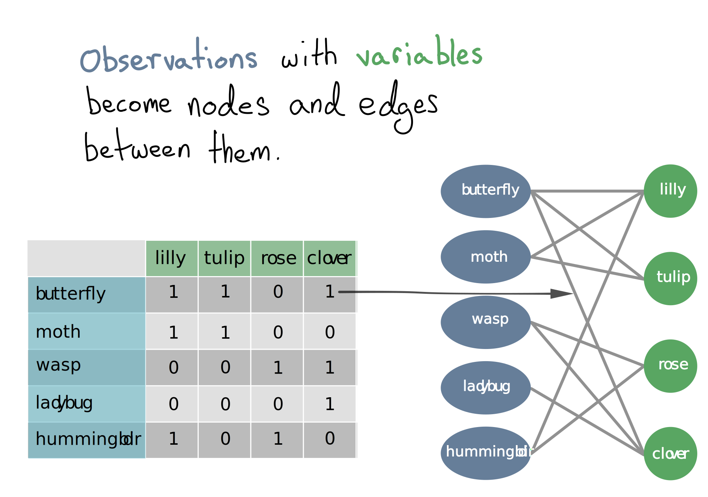

<style>
.remark-slide-number {
  position: inherit;
}

.remark-slide-number .progress-bar-container {
  position: absolute;
  bottom: 0;
  height: 15px;
  display: block;
  left: 0;
  right: 0;
}

.remark-slide-number .progress-bar {
  height: 100%;
  background-color: red;
  width: calc(var(--progress) / var(--total) * 100%);
}

.remark-slide-number .progress-bar:after {
  content: calc(var(--progress));
}

```{r setup}

fa <- function(name, ...) icon::fa(name, fixed_width = TRUE, size = 'lg', color = "#e34a33", ...)
```


## Abstract

Extracting informative and meaningful results from EHR and Biobank data is an important task in genomic data science. Up to now statistically principled methods that can find robust and explainable multivariate patterns in these data have yet to take hold. Existing analysis frameworks have difficulty dealing with both the high-dimensionality of such data and also how to communicate the results in an intuitive and actionable way.
 These methods have already been successfully deployed in real-world collaboration scenarios; furthermore, simulations of the theoretical properties of the methods have shown they are consistent and powerful in extracting multivariate patterns. By merging network-science and statistics these methods have the potential to produce more efficient and intuitive analysis tools for dealing with complex EHR and biobank data.


In this talk I will go over some of the recent work we have done with PheWAS data that views it as a bipartite network of individual-feature relationships instead of the traditional observation and variable view; in addition we will show new visualization tools we've developed that allow collaborators to interact with these networks to interrogate genotype-phenotype associations.

---
# Talk outline

- Electronic medical records
- PheWAS
  - Concept
  - Univariate Problem
- Changing how we _think about_ these data
- Multimorbidity explorer
  - What it is
  - How it is
  - Demo
- Changing how we _model_ these data
- The stochastic block model
  - Bipartite expansion
  - Statistical rigor
  - Simulation results
- Applying on real data
  - MDS
  - Heart failure
  - RNA Seq
- Future directions


---

# Electronic medical records (EHR)


- In an effort to make healthcare more efficient EHR systems have become common in the US. 

- While originally made for billing purposes there is still a huge sum of information that, with careful effort, _hopefully_, can be extracted for research.

- In this presentation I will focus on the subset of EHR pertaining to billing codes: ICD9, ICD10, and Phecodes.

 )


---
# Biobanks

![:space 4] 

`r fa('piggy-bank')` Some hospitals have repositories of biological samples that can be matched to their EHR.

![:space 8] 

`r fa('syringe')` Data could be anything from plain unprocessed-plasma all the way to full single-cell sequencing. 

![:space 8] 

`r fa('dna')` Here I will focus on plain SNP-chip readings, aka presence or absence of a given marker at multiple points on the genome.


---


# PheWAS

In an effort to extract information from these results the technique PheWAS was made.

![:space 8] 


---

## Concept


---

## The univariate problem


`r fa('hand-point-up')` PheWAS looks at one genome `r icon::fa('arrow-right')` phenome association at a time.


.pull-left[
`r fa('stream')` This gives us the multiple-comparisons problem.
]
.pull-right[
`r fa('project-diagram')`Also, does the world work like this? 
]


---


# Changing how we   these data



---
# Multimorbidity explorer


---
## What it is


Application that allows researchers to explore the results of PheWAS studies along with investigating individual-level data that produced those results.
    
    


.pull-left[
#### `r fa('hand-point-up')` Interact with results 

PheWAS results are typically delivered with static plots and tables. ME allows researchers to interact with those results.

]

.pull-right[
#### `r fa('expand-arrows-alt')` Expand past plain associations

By giving researcher's the ability to look at the network behavior of genotype-phenotype associations, it can provide more nuanced insights from the data than a table. 
]


---
## How it is


`r fa('box-open')` Central package contains all the building blocks of a typical ME deployment.


`r fa('puzzle-piece')` Creating a custom app is an exercise in combining the neccesary components. 


`r fa('cloud')` Hosted on lab RStudio Connect instance running on AWS.
  
  `r fa('docker')` If more security is desired, Docker image is available.

---
## Demo

---


# Changing how we  these data


`r fa('project-diagram')` If visualizing the data as a network can help us understand them, why not model them as a network, too?


`r fa('level-up-alt')` Mathematical and statistical models of networks are a diverse and booming field. 


`r fa('frown-open')` Unfortunately, many of the methods sit on fragile methodological foundations.

 `r fa('grin')` Luckily, a new model type has taken the stage recently...

---


## The tochastic lock odel


---
## SBM formula


---
## Bipartite expansion

In its basic form the SBM only works with a single type of node, but we have two (phenotype and patients)...


`r fa('wrench')` To fix this all we need to do is add a constraint to the model to only cluster nodes of the same type.

   This is equivalent to an infinitely strong prior on cluster 'types'.


---
## Bipartite SBM formula


---
## Statistical properties

Model is fit in a bayesian manor

.pull-left[

### Priors
Priors are set on both the group/cluster structure and the edge counts between groups.
]

.pull-right[

### Fitting
Metropolis-Hastings is used to fit model using MCMC

Very similar to how a Dirichlete mixture model is fit

]

---
### Prior on clusters


---

### Prior on edge counts


---
## Simulation results


The BiSBM outperforms dirichlet mixture models even when the true generating distribution is dirichlet. 


.right[

]

---

# Applying in the real world


---

# Future directions
